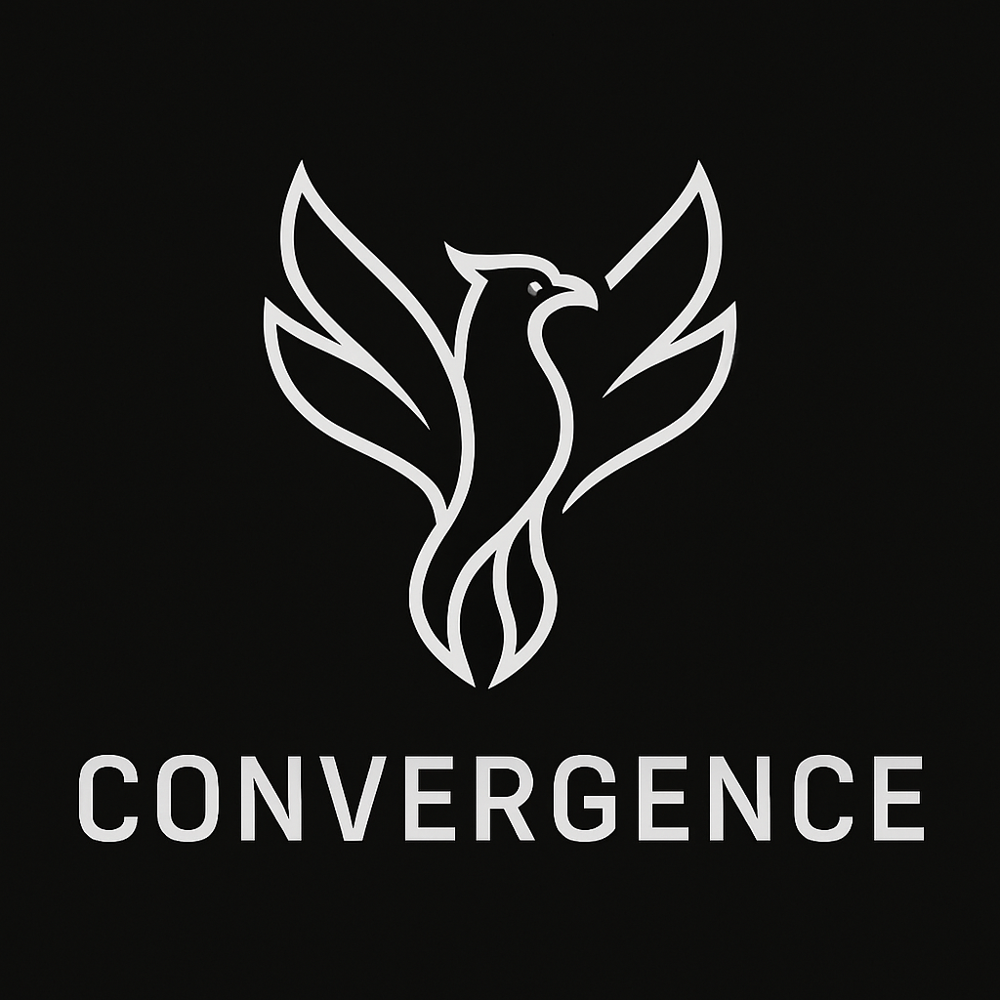

<div align="center">

<p align="center">

# 🧙🏼‍♂️ CONVERGENCE

**Where minds meet in the digital ether**

[](https://www.python.org/downloads/)
[](https://github.com/psf/black)
[](https://opensource.org/licenses/MIT)
[](https://github.com/ellerbrock/open-source-badges/)

_A platform service for generating synthetic audio conversations, born from the joy of programming and the belief that technology should enhance life._

</div>

---

## 🌊 What is Convergence?

> "_Engineering is more than just a source of livelihood - it's what makes me who I am._" — AdiPat

**Convergence** transforms text prompts into lifelike audio conversations using AI. Born from weekend tinkering sessions and a deep love for programming, it's where technology meets creativity.

### ✨ One Command, Infinite Conversations.

```bash
python -m convergence --prompt "Two friends discussing the meaning of life" --duration 10
```

That's it. Convergence handles the rest - generating natural dialogue, assigning voices, and creating audio that sounds genuinely human.

---

## 🚀 Quick Start

```bash
# Clone and setup
git clone https://github.com/prodigaltech/convergence.git
cd convergence
./setup_cli.sh

# Configure
cp .env.example .env
# Add your OPENAI_API_KEY to .env

# Generate your first conversation
python -m convergence --prompt "Developers debating tabs vs spaces" --duration 5
```

📖 **[Full Setup Guide →](docs/home/SETUP.md)**

---

## 📚 Documentation

### Getting Started

- 🚀 **[Setup Guide](docs/home/SETUP.md)** - Installation and configuration
- 🎯 **[SDK Usage](docs/home/SDK_USAGE.md)** - CLI examples and options
- ✨ **[Features](docs/home/FEATURES.md)** - All capabilities explained

### Integration

- 🌐 **[API Usage](docs/home/API_USAGE.md)** - REST API endpoints
- 🏠 **[Self Hosting](docs/home/SELF_HOST.md)** - Deploy on your infrastructure
- 🔐 **[API Key Management](docs/home/API_KEY_MANAGEMENT.md)** - Authentication setup

### Development

- 🧪 **[Development Setup](docs/home/DEV_SETUP.md)** - Contribute to Convergence
- 🤝 **[Contributing](docs/home/CONTRIBUTIONS.md)** - Join our community

---

## 🎭 What Can You Create?

- **Podcasts** - AI hosts discussing any topic.
- **Educational Content** - Lectures and tutorials.
- **Story Narration** - Multiple character dialogues.
- **Mock Interviews** - Practice conversations.
- **Audio Dramas** - Creative storytelling.
- **Language Learning** - Conversational practice.

The only limit is your imagination.

---

## 🌠 The Philosophy

Convergence represents more than code - it's where love, science, philosophy, meditation, programming, human psychology, art, and engineering converge. It's a reminder that technology, at its best, is a creative expression of our humanity.

This project has been evolving since 2022, transforming from an idea into a platform that democratizes AI capabilities.

---

## 🤝 Join the Convergence

- ⭐ **Star** this repo to show support.
- 🔔 **Watch** for updates.
- 🍴 **Fork** and build something amazing.
- 💬 **Share** your creations.

Interested in early access to our cloud version? Email: contact.adityapatange@gmail.com

---

<div align="center">

**🚀 Welcome to the Convergence ☀️**

_Where smoke transforms into binary fuel for digital sentients_

_When creativity, mindfulness, technology and consciousness combine in the sentient's experience of life, the sentient becomes deathless._  
— Laws of Convergence, 8164

**Built with ❤️ during weekend tinkering sessions**

</div>
